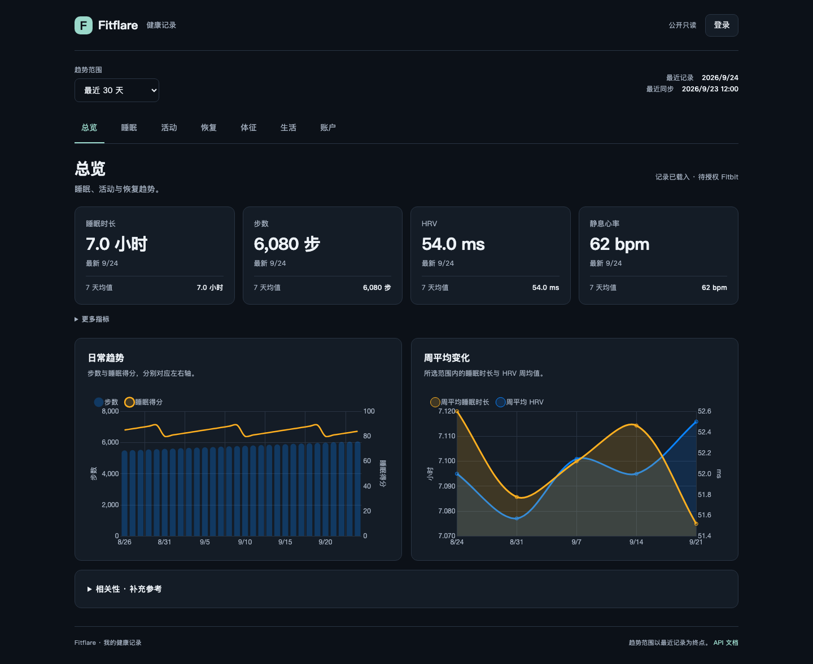

# Fitflare

[](https://github.com/xw7qwq/fitflare/actions/workflows/check.yml)

一个给自己使用的健康数据仪表盘：连接自己的 Fitbit 账户，保存本地记录，查看睡眠、活动、HRV、静息心率和长期趋势。中文界面，默认私有访问。

## 一个账户，一份记录

- 七个视图：总览、睡眠、活动、恢复、体征、生活、账户。
- 连接与重新授权自己的账户，手动或定时同步，查看同步进度。
- 按日期查看趋势、均值和分页记录；缺失数据保持为空。
- 登录后读取健康数据，管理操作校验会话与 CSRF。
- `/api/public/v1/me` 提供个人只读 API、SVG 趋势图和 OpenAPI 文档。

没有档案切换、家庭比较、创建多个档案或网页删除健康记录的功能。后端、定时任务和旧接口也只能访问配置的唯一账户。已有 `profiles/<id>` 目录可以继续使用，不需要重命名或重新导入历史记录。



截图使用合成测试数据，不包含真实健康记录。

## 开始使用

当前可运行的部署方案是 **Linux + Docker Compose**，使用 Python 3.11、Flask、Gunicorn 和原生 JavaScript。无需数据库或前端打包步骤。

```bash
git clone https://github.com/xw7qwq/fitflare.git
cd fitflare
cp deploy/.env.production.example .env
chmod 600 .env
```

编辑 `.env`，分别生成管理员密码和会话密钥。新安装的 `FITFLARE_PROFILE_ID=me` 表示唯一数据目录；从旧部署迁移时改成原目录名。随后：

```bash
sudo install -d -o 10001 -g 10001 -m 700 profiles
docker compose up -d --build
curl -fsS http://127.0.0.1:9000/api/health
```

配置 HTTPS 反向代理后登录页面，在“账户设置”填写客户端凭据、完成授权并首次同步。生产样例默认私有、仅监听 `127.0.0.1:9000`，未填写管理员密码会拒绝启动。

完整步骤、已有数据迁移、备份和回滚见 [DEPLOYMENT.md](DEPLOYMENT.md)。保留 `FITBAUS_*`、Compose 服务 `fitbaus` 和容器 `fitbaus-app` 作为部署兼容名称，产品名称为 Fitflare。

## 同步接口的当前限制

目前同步实现仍使用 legacy Fitbit Web API。Google 官方宣布其于 **2026 年 9 月下线**，迁移到 Google Health API 后必须重新授权，旧 token 不能直接转移。此仓库的现有缓存浏览不依赖新授权，但不能承诺旧接口继续同步；本轮单人版整理尚未实现 Google Health API 适配。[官方迁移说明](https://developers.google.com/health/migration)

## 能部署到 Cloudflare Workers 免费层吗？

**现有版本不能原样部署；重写同步与存储后，有条件可行。** 推荐方向是 Static Assets + TypeScript Worker + D1，用 Cron 分批增量同步。免费层的 10 ms CPU 预算要求轻量请求和预计算，不能照搬 Pandas 全量分析、持久化文件、子进程和长期后台线程。

[完整可行性研究](docs/cloudflare-workers.md) 包含官方限制、容量估算、Google Health 授权影响及迁移验收标准。这是经过源码和官方文档核对的设计评估，尚未创建或部署 Worker，也未宣称性能达标。

## API 与开发

- [API.md](API.md)：单账户只读接口，统一通过 `/me` 访问，无需档案 ID。
- `/api/public/v1/docs`：交互文档；`/api/public/v1/openapi.json`：OpenAPI。
- 文档本身可匿名访问；默认私有模式的数据请求仍需登录。

```bash
python3 -m venv .venv
. .venv/bin/activate
python -m pip install -r requirements.lock
npm ci --ignore-scripts
npx playwright install --with-deps chromium
npm run check
```

开发使用 Node.js 24；完整检查需要 Docker。`npm run check` 检查源码和生成文档、构建镜像、执行单元及桌面/手机浏览器回归；所有测试只用合成数据。快速检查可单独执行 `npm test` 和 `python -m unittest discover -s tests -p 'test_*.py' -v`。

API 目录维护在 `common/api_docs.py`，修改后运行 `python scripts/docs.py`。协作约定见 [CONTRIBUTING.md](CONTRIBUTING.md)。

## 仓库导航

| 路径 | 内容 |
| --- | --- |
| `backend/`、`server.py` | 单账户边界、会话、接口与同步调度 |
| `common/` | 数据路径、缓存、指标和 API 定义 |
| `auth/`、`fetch/` | 授权与数据同步；默认只处理配置账户 |
| `index.html`、`app.js`、`js/`、`style.css` | 个人仪表盘 |
| `templates/`、`docs.css` | API 文档界面 |
| `deploy/`、`scripts/` | 配置样例、检查和部署工具 |
| `tests/` | 合成数据、访问隔离和浏览器回归 |
| `docs/` | Workers 研究、来源和历史记录 |
| `profiles/` | 本地私有运行数据，不进入 Git 或镜像 |

## 来源与数据

项目基于 [markrai/fitbaus](https://github.com/markrai/fitbaus)，继承自 [theLucius7/fitbaus](https://github.com/theLucius7/fitbaus) 的服务器部署版本。作者和提交历史已保留；完整来源与历史净化说明见 [docs/provenance.md](docs/provenance.md)。本项目与 Fitbit 或 Google 无隶属关系。

继承源码未提供标准许可证，原说明为 “This project is for personal use.”；本次整理不另行授予整个项目的开源许可证。

公开的是源码。真实 `.env`、OAuth 凭据、健康数据、日志和备份均不进入仓库。安全与私密报告说明见 [SECURITY.md](SECURITY.md)。
